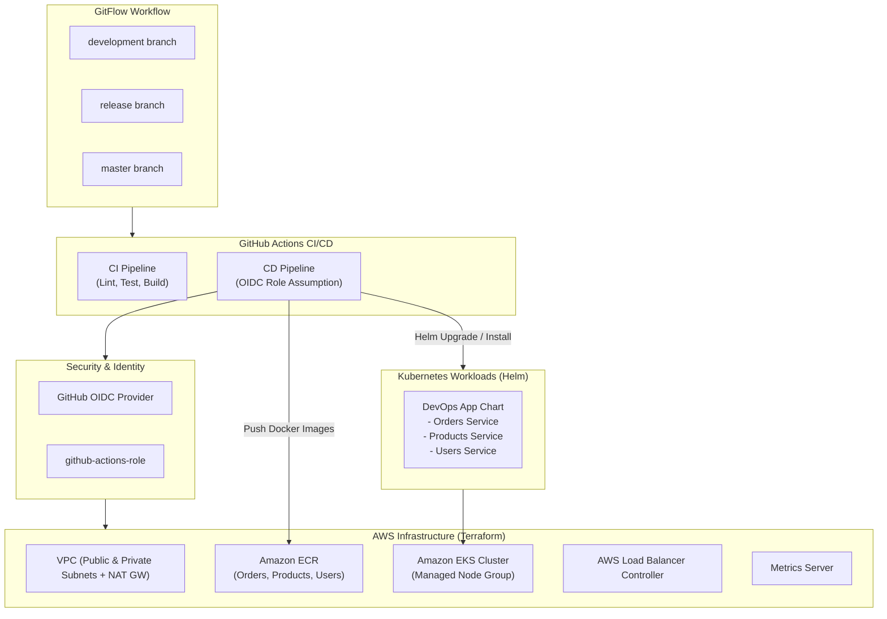

# AWS DevOps: Automated Microservices Infrastructure with Terraform, Amazon EKS & GitHub Actions

An enterprise-grade, multi-environment DevOps project implementing **Infrastructure as Code (IaC)** with **Terraform**, container orchestration with **Amazon EKS (Kubernetes)**, package management via **Helm**, and automated **GitFlow CI/CD** pipelines powered by **GitHub Actions** with **AWS IAM OIDC** keyless authentication.

---

## Architecture Overview



---

## Key Features

- **Multi-Environment Infrastructure:** Isolated environments for **Development**, **Staging**, and **Production** managed by Terraform.
- **GitFlow Branching & CI/CD Strategy:** Automated pipelines triggered on branch events (`feature/*` -> `development` -> `release` -> `master`).
- **Keyless AWS Authentication:** Secure IAM authentication using **GitHub Actions OIDC** without long-lived static AWS credentials.
- **Resilient Terraform Design:** Remote state stored in **Amazon S3** with distributed locking via **Amazon DynamoDB** and deterministic provider locking via `.terraform.lock.hcl`.
- **EKS Access Entries & IRSA:** Modern AWS EKS Access Entries with `AmazonEKSClusterAdminPolicy` and IAM Roles for Service Accounts (IRSA) for the AWS Load Balancer Controller.
- **Container Registry & Lifecycle:** Dedicated ECR repositories with automatic image expiry policies keeping the 10 most recent images.
- **Microservices Deployment:** Parameterized Helm chart deploying 3 distinct services (`orders-service`, `products-service`, `users-service`) with resource limits and dynamic tagging.

---

## Repository Structure

```text
├── .github/
│   └── workflows/
│       ├── ci.yaml                # CI: Unit tests & build verification on Pull Requests
│       └── cd.yaml                # CD: Terraform Apply, Docker build/push, Helm deployment
├── helm/
│   └── devops-app/                # Helm chart for application microservices
│       ├── templates/             # Deployments, Services, and ServiceAccounts
│       ├── Chart.yaml
│       └── values.yaml            # Environment and service configurations
├── public/                        # Static demo assets and stylesheets
├── src/                           # Express.js microservices source code
├── terraform/
│   ├── environments/              # Environment configurations & remote backends
│   │   ├── development/           # Dev environment (dev.tfvars, backend.tf, lockfile)
│   │   ├── staging/               # Staging environment (staging.tfvars, backend.tf, lockfile)
│   │   └── production/            # Production environment (production.tfvars, backend.tf, lockfile)
│   └── modules/                   # Reusable infrastructure modules
│       ├── aws-load-balancer-controller/ # OIDC, IAM role, and Helm release for AWS LBC
│       ├── ecr/                   # ECR repositories with automated lifecycle policies
│       ├── eks/                   # EKS Cluster, Node Groups, Access Entries, Policies
│       ├── github-oidc/           # IAM OIDC Identity Provider & GitHub Actions role
│       ├── metrics-server/        # Kubernetes Metrics Server Helm release
│       └── vpc/                   # VPC, Public/Private Subnets, NAT GW, Route Tables
├── Dockerfile                     # Multi-service container build definition
├── package.json                   # Application dependencies and scripts
└── README.md                      # Project documentation
```

---

## Environments & Branching Strategy

| Branch | Target Environment | EKS Cluster Name | ECR Repositories | State File Key |
| :--- | :--- | :--- | :--- | :--- |
| `development` | `dev` | `dev-eks-cluster` | `dev-*` | `development/terraform.tfstate` |
| `release` | `staging` | `staging-eks-cluster` | `staging-*` | `staging/terraform.tfstate` |
| `master` | `production` | `production-eks-cluster` | `production-*` | `production/terraform.tfstate` |

### GitFlow Pipeline Stages

1. **Feature Development (`feature/*`):** Developers create feature branches and open a Pull Request against `development`.
2. **Pull Request Validation (`ci.yaml`):** GitHub Actions runs dependency installation, automated tests, and build checks.
3. **Development Deployment (`cd.yaml`):** Merging into `development` automatically runs Terraform apply, builds and pushes Docker images to `dev-*` ECR, and deploys to `dev-eks-cluster`.
4. **Staging / Release Candidate (`release`):** Merging `development` into `release` deploys infrastructure and containers to the pre-production `staging` environment.
5. **Production Release (`master`):** Merging `release` into `master` promotes the changes to the high-availability `production` environment.

---

## Infrastructure Architecture (Terraform Modules)

### 1. Networking (`modules/vpc`)
- Dedicated VPC per environment with DNS hostnames and support enabled.
- 2 Public Subnets across multiple Availability Zones with `kubernetes.io/role/elb = 1` for public Load Balancers.
- 2 Private Subnets across multiple Availability Zones for secure worker node placement.
- Elastic IP (EIP) and NAT Gateway for outbound internet access from private subnets.
- Isolated public and private Route Tables with proper subnet associations.

### 2. Elastic Kubernetes Service (`modules/eks`)
- Amazon EKS Cluster (Kubernetes 1.30+) deployed into private subnets.
- Managed Node Group with auto-scaling (min: 2, desired: 3, max: 4) using `t3.small` / `t3.medium` instances.
- IAM roles and policies:
  - Cluster IAM Role: Environment-scoped (`${var.environment}-eks-cluster-role`) with `AmazonEKSClusterPolicy`.
  - Node Group IAM Role: Attached with `AmazonEKSWorkerNodePolicy`, `AmazonEKS_CNI_Policy`, and `AmazonEC2ContainerRegistryReadOnly`.
- Modern Access Entries:
  - `aws_eks_access_entry` for `github-actions-role`.
  - `aws_eks_access_policy_association` attaching `AmazonEKSClusterAdminPolicy` to grant CI/CD admin rights in Kubernetes RBAC.

### 3. Container Registry (`modules/ecr`)
- Encrypted repositories (`AES256`) created for each service:
  - `${var.environment}-orders-service`
  - `${var.environment}-products-service`
  - `${var.environment}-users-service`
- Immutable image tags and vulnerability scanning enabled on push.
- Automated lifecycle policies pruning images beyond the 10 most recent versions to optimize storage costs.

### 4. Kubernetes Controllers & Addons
- **AWS Load Balancer Controller:** Configured with IAM Roles for Service Accounts (IRSA) via OIDC federated credentials, automatically provisioning and managing AWS Application Load Balancers (ALBs).
- **Metrics Server:** Deployed via Helm to provide cluster-wide resource metrics for Kubernetes Horizontal Pod Autoscalers (HPA).

---

## CI/CD Workflow Breakdown

### Continuous Integration (`ci.yaml`)
Triggered on pull requests to `development`, `release`, and `master`:
1. Checks out repository code.
2. Sets up Node.js 20 with npm caching.
3. Installs dependencies (`npm install`).
4. Runs unit tests (`npm run test`).
5. Executes build step (`npm run build`).

### Continuous Deployment (`cd.yaml`)
Triggered on direct push to `development`, `release`, and `master`:
1. **OIDC Authentication:** Assumes `arn:aws:iam::<ACCOUNT_ID>:role/github-actions-role` using short-lived tokens via `aws-actions/configure-aws-credentials`.
2. **Dynamic Environment Context:** Maps the active Git branch to the corresponding environment variables (`ENV_NAME`, `TF_WORKING_DIR`, `TF_VARS_FILE`, `EKS_CLUSTER_NAME`).
3. **Terraform Apply:** Initializes and validates Terraform, then runs `terraform apply -auto-approve` to ensure infrastructure is up to date.
4. **Docker Image Build & Push:** Authenticates to Amazon ECR, builds images for all three services, tags them with both `latest` and `${{ github.sha }}`, and pushes them to ECR.
5. **Helm Deployment:** Updates cluster credentials via `aws eks update-kubeconfig` and executes `helm upgrade --install` with environment parameters.

---

## Engineering Challenges & Solutions

During the implementation of the multi-environment pipeline, several complex architectural challenges were identified and solved:

### 1. Helm Provider v3 Syntax vs. Provider Pinning
- **Problem:** Helm Provider v3 deprecated the block syntax `kubernetes { ... }` in favor of an attribute `kubernetes = { ... }`. Because `development` had an existing `.terraform.lock.hcl` locked to `v2.17.0` while `staging` had no lockfile, `staging` downloaded Helm v3 and failed during `terraform validate`.
- **Solution:** Pinned `hashicorp/helm` to version `~> 2.17.0` across all environments via `required_providers` and committed identical `.terraform.lock.hcl` files to `staging` and `production`, ensuring deterministic builds.

### 2. IAM Role Name Collisions Across Environments
- **Problem:** IAM role names in AWS are global across the account. The EKS cluster role was initially hardcoded as `name = "eks-cluster-role"`. When `staging` attempted to deploy in the same AWS account, it threw `EntityAlreadyExists (409)`.
- **Solution:** Parameterized the role name using environment scoping (`${var.environment}-eks-cluster-role`), while adding a condition for development to protect the running dev cluster from destruction (`# forces replacement`).

### 3. EKS Access Entry Management & 403 Forbidden
- **Problem:** AWS automatically creates an Access Entry for the cluster creator when `bootstrap_cluster_creator_admin_permissions = true`. Explicitly creating `aws_eks_access_entry` for the same role caused a 409 collision, while disabling it prevented `aws_eks_access_policy_association` from granting `AmazonEKSClusterAdminPolicy`, leading to `403 Forbidden` errors during Helm controller installations.
- **Solution:** Decoupled entry creation (`create_access_entry = false`) from policy association (`enable_github_actions = true`), allowing Terraform to cleanly attach `AmazonEKSClusterAdminPolicy` to the pre-existing access entry without collision.

### 4. Naming Consistency Between CI/CD and Infrastructure
- **Problem:** The `cd.yaml` pipeline used the abbreviation `prod` (`prod-orders-service`, `prod-eks-cluster`), while `production.tfvars` provisioned resources using `production` (`production-orders-service`, `production-eks-cluster`), causing Docker push failures (`name unknown: repository does not exist`).
- **Solution:** Standardized naming across workflows, Helm templates, and Terraform variables to use `production`, ensuring perfect alignment between build artifacts and infrastructure resources.

---

## Prerequisites & Getting Started

### Local Prerequisites
- [AWS CLI v2](https://docs.aws.amazon.com/cli/latest/userguide/install-cliv2.html) configured with administrative credentials.
- [Terraform](https://developer.hashicorp.com/terraform/downloads) >= 1.9.5.
- [kubectl](https://kubernetes.io/docs/tasks/tools/) matching your cluster version.
- [Helm](https://helm.sh/docs/intro/install/) >= 3.x.
- [Node.js](https://nodejs.org/) >= 18.x.

### Running Infrastructure Locally (e.g., Development)

1. **Navigate to the target environment:**
   ```bash
   cd terraform/environments/development
   ```

2. **Initialize Terraform with remote backend:**
   ```bash
   terraform init
   ```

3. **Validate configuration:**
   ```bash
   terraform validate
   ```

4. **Review execution plan:**
   ```bash
   terraform plan -var-file="development.tfvars"
   ```

5. **Apply changes:**
   ```bash
   terraform apply -var-file="development.tfvars"
   ```

---

## License

This project is licensed under the MIT License - see the [LICENSE](LICENSE) file for details.

## Author

**Roberto Palacios** — [LinkedIn](https://www.linkedin.com/in/robpalacios1)
**Portfolio** - [Portfolio](https://robpalacios1.com)
